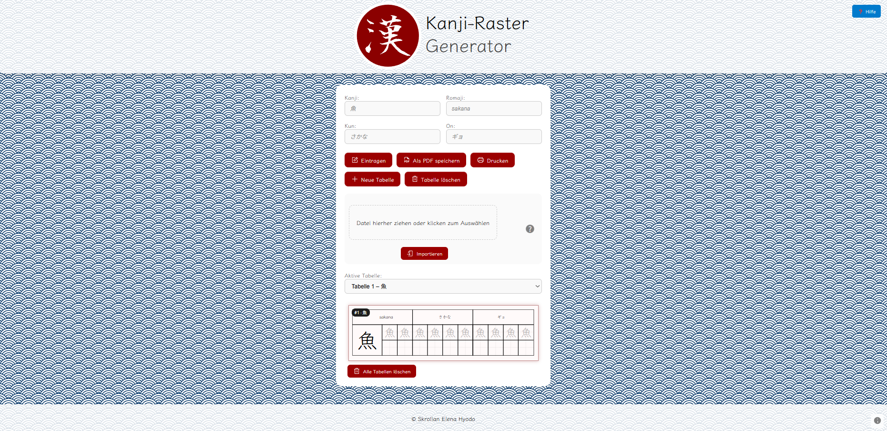

# KakuKanji

Interactive tool for learning Kanji with animated stroke order, Excel/XLS import, and PDF export. Fully browser-based (frontend-only).

---

## Live Demo

[https://schokett.github.io/KakuKanji/](https://schokett.github.io/KakuKanji/)


---

## Features

* Animated stroke order for each Kanji
* Romaji, On, and Kun readings
* Custom tables via Excel/XLS import
* PDF export of Kanji tables
* Table filtering and sorting
* Fully browser-based, no backend required

---

## Technologies

* HTML, CSS/SCSS, JavaScript
* SVG animations + CSS for stroke order visualization
* jsPDF + svg2pdf.js for PDF generation
* XLS/Excel import via JavaScript library

---

## Installation & Usage

1. Clone the repository:

```bash
git clone https://github.com/Schokett/KakuKanji.git
cd KakuKanji
```

2. Open the project in a browser (`index.html`)

3. Select Kanji from existing tables or upload your own Excel/XLS file

4. View animated stroke orders and export PDFs as needed

---


Klar! Hier ist eine saubere englische Version deines Textes:

---

## Data Sources & License Notices

[https://schokett.github.io/KakuKanji/](https://schokett.github.io/KakuKanji/)

This project uses Kanji data & SVGs from the KanjiVG project.
© 2009–2025 Ulrich Apel – License: CC BY-SA 3.0.
Modifications: formatting & integration into this website.

